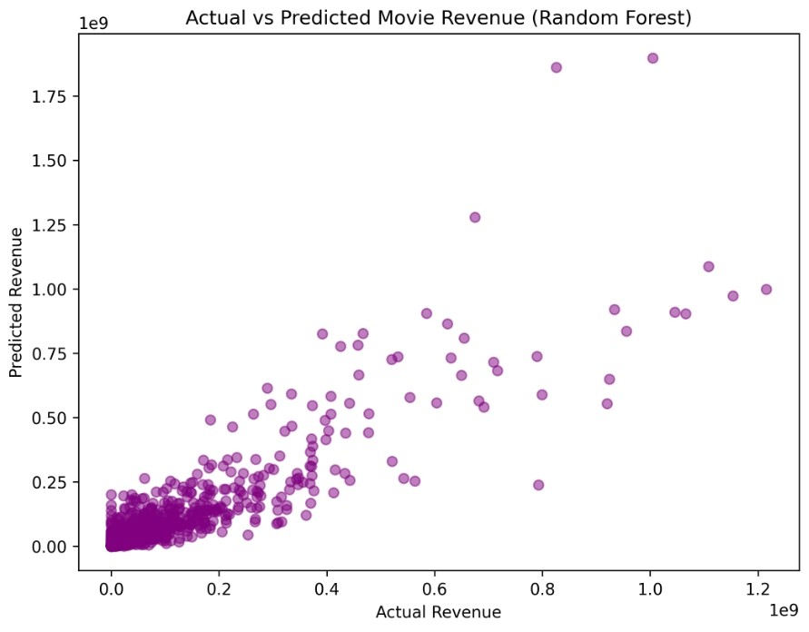

🎬 Movie Revenue Prediction using Random Forest

Ever wondered how much 💰 a movie might earn before it even hits the theatres?
This project aims to predict box office revenue using machine learning — powered by Random Forest Regressor 🌲!

📌 Problem Statement

Can we predict the revenue of a movie using only pre-release information?
Using supervised ML techniques, this project provides a solid attempt to answer this industry-relevant question 🎯.

💡 Project Highlights

✨ Highlights of the project:

✅ Built using Random Forest Regressor
✅ Tuned with max_depth=10 for better results
✅ Benchmarked against Linear Regression
✅ Visualized predictions vs. actual revenue for better insights 📊

📊 Dataset Used

📁 Dataset:

tmdb_5000_movies.csv

tmdb_5000_credits.csv
📌 Source: ()

## 🧪 Features Used

| Feature         | Description                          |
|----------------|--------------------------------------|
| `budget`       | Estimated production budget 💸        |
| `popularity`   | Popularity score from TMDB 🔥         |
| `runtime`      | Movie duration in minutes 🎞️          |
| `vote_average` | Average user rating ⭐                |
| `vote_count`   | Number of user votes 🗳️              |
| `release_year` | Year of release 📅                   |

🔧 Model & Evaluation

🏁 Final Model:

from sklearn.ensemble import RandomForestRegressor

model = RandomForestRegressor(max_depth=10, random_state=42)
model.fit(X_train, y_train)

📈 Evaluation Metrics:

Metric	Value

📉 MAE (Mean Absolute Error)	₹40,102,608
📊 R² Score	0.73

> ✅ The model shows reasonable accuracy using limited but meaningful features!

📉 Visual Output

🖼️ A clear plot comparing actual vs predicted revenue to showcase performance:
📍 ()

📦 Installation

🔧 To run the project:

pip install -r requirements.txt

🗂️ Project Structure

📦 Movie Revenue Prediction
├── 📒 movie_revenue_prediction.ipynb
├── 📄 requirements.txt
├── 📄 README.md
└── 📁 data/
    ├── tmdb_5000_movies.csv
    └── tmdb_5000_credits.csv

✨ Author

👨‍💻 Farid Shaikh

🎓 An undergraduate student
❤️ Passionate about solving real-world problems using ML & AI

> 🌟 If you like this project, feel free to ⭐ star the repo and follow for more!
